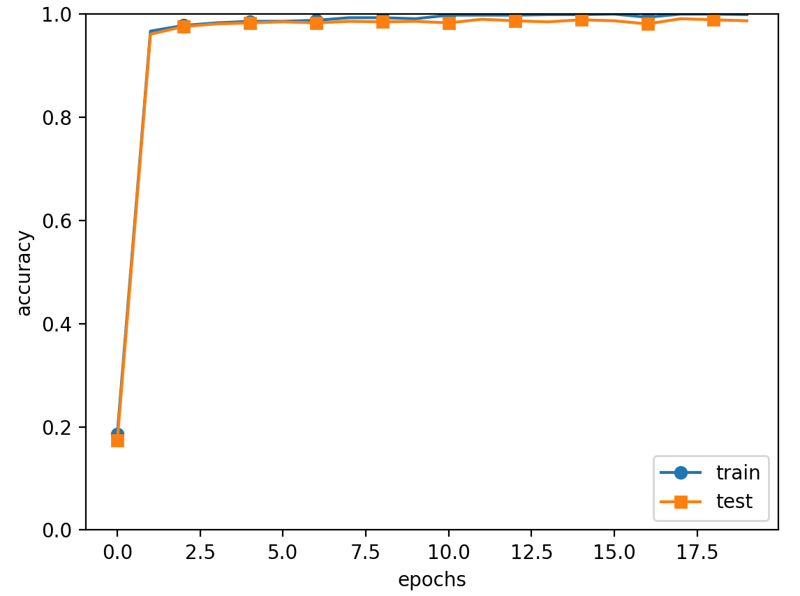

# 资料参考
http://www.ituring.com.cn/book/1921
# 概述

## ch1

img_show.py 报错

解决：将文件的相对路径换成绝对路径即可。

## ch2

与或非、异或四个逻辑实现

## ch3

| 名称 | 功能 | 备注 |
| --- | --- | --- |
| step_function.py | 冲激函数 |  |
| http://sigmoid.py/  | 平滑激活函数 |  |
| http://relu.py/  | 线性激活函数 |  |
| sig_step_compare.py | 两曲线的对比 |  |
| mnist_show.py | 图像读取实例 |  |
| neuralnet_mnist.py | 一个较完整的神经网络 | 还有一个batch版本，其中有需要更改路径的地方 |

一个注意点：

观察本书源代码可知，上述代码在mnist_show.py文件中。mnist_show.py文件的当前目录是ch03，
但包含 load_mnist()函数的 mnist.py文件在 dataset目录下。因此，mnist_show.py文件不能跨目
录直接导入 mnist.py文件。sys.path.append(os.pardir)语句实际上是把父目录 deep-learning-
from-scratch加入到 sys.path（Python的搜索模块的路径集）中，从而可以导入 deep-learning-
from-scratch下的任何目录（包括dataset目录）中的任何文件。——译者注

报错：ModuleNotFoundError: No module named 'dataset’

解决参考：[https://blog.csdn.net/octopassy/article/details/118650137](https://blog.csdn.net/octopassy/article/details/118650137)

补充：

一些基本的函数整合在common [的 functions.py](http://的functions.py) 中，common也需要导入到Ananconda3的库中

找不到文件：FileNotFoundError: [Errno 2] No such file or directory: 'sample_weight.pkl’

解决：将文件的相对路径换成绝对路径即可。

## ch4

| 名称 | 功能 | 备注 |
| --- | --- | --- |
| gredient_1d.py | 简单实现求梯度的功能 |  |
| gredient_2d.py | 二维层面的较复杂方式 |  |
| gredient_method.py | 梯度下降法 | 含学习率 |
| gredient_simplenet.py | 计算数值梯度的简单网络 |  |
| two_layer_net.py | 两层网络的一个封装实现 |  |
| train_neuralnet.py | 一个正式训练网络 | 含epoach、精确度计算 |

## ch5

| 名称 | 功能 | 备注 |
| --- | --- | --- |
| buy_apple.py | 买苹果的计算图逻辑实现 | 计算图 |
| buy_apple_orange.py | 逻辑实现 |  |
| layer_native.py | 加法器、乘法器的前后向实现 |  |
| two_layer_net.py | 两层网络实现 | 涉及Affine层 |
| gredient_check.py | 梯度确认 | 误差反向传播与数值梯度的对比 |
| train_neuralnet.py | 使用误差反向法进行学习 | 测试精准度达到0.9697 |

## ch6

| 名称 | 功能 | 备注 |
| --- | --- | --- |
| optimizer_compare_native.py | 四种更新参数方法的对比 | SGD、Momentum、AdaGrad、Adam |
| optimizer_compare_mnist.py | 四种方法进行学习对比 |  |
| weight_init_activation_histogram.py | 隐藏层的激活值 | sigmoid、ReLU、tanh |
| weight_init_compare.py | 隐藏层不同激活函数的学习对比 |  |
| batch_norm_test.py | 加上batch_norm与不加时的精度对比 | Batch Norm 是一种针对mini_batch的学习方法 |
| batch_norm_gradient_check.py | 用梯度确认的方式检验batch_norm的效果 |  |
| overfit_weight_decay.py | 用权值衰减的方法来抑制过拟合 | 为损失函数加上L2范数 |
| overfit_dropout.py | 用Droupout的方法来抑制过拟合 | 随机删除隐藏层的神经元。训练过程“承包”给Trainer类 |
| hyperparameter_optimization.py | 超参数的优化过程 |  |

## ch7

| 名称 | 功能 | 备注 |
| --- | --- | --- |
| simple_convnet.py | 一个简单的卷积神经网络SimpleConvNet |  |
| gradient_check.py | 梯度确认 | 针对的是SimpleConvNet |
| train_convnet.py | 应用SimpleConvNet进行数字识别学习 | 有强度的训练！！  结果展示：test acc:0.989
Saved Network Parameters! 见下图 |
| visualize_filter.py | SimpleConvNet的第一层权重的可视化 |  |
| apply_filter.py | SimpleConvNet的滤波可视化 | 响应图像边缘 |

## ch8

| 名称 | 功能 | 备注 |
| --- | --- | --- |
| deep_convnet.py | 一个具有更深层次的卷积神经网络DeepConvNet |  |
| train_deepnet | 应用DeepConvNet进行训练 |  |
| misclassified_mnist.py | 应用DeepConvNet进行训练后错误分类的例子 |  |
| half_float_network.py | 应用DeepConvNet进行半精度浮点型训练 |  |

## common

common中存的是一些常见的封装类实现

## dataset

存放的是静态资源和加载类实现